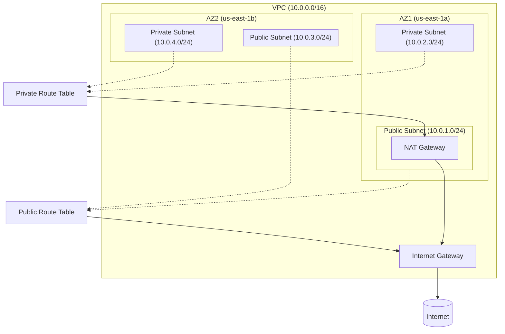

<h1 align="center">
  <br>
  AWS Multi-AZ Production VPC
  <br>
</h1>

<h3 align="center">
  Terraform | AWS | Infrastructure as Code | Cloud Architecture | DevOps
</h3>

<p align="center">
  <strong>Production-grade, multi-availability zone VPC infrastructure for enterprise AWS deployments</strong>
</p>

<p align="center">
  <a href="#-key-features">Key Features</a> •
  <a href="#-architecture">Architecture</a> •
  <a href="#-quick-start">Quick Start</a> •
  <a href="#-documentation">Documentation</a>
</p>

<p align="center">
  
  
  
  
</p>

---

## Project Highlights

| Metric | Value |
|--------|-------|
| **Infrastructure Resources** | 15+ AWS resources orchestrated |
| **Availability Zones** | Multi-AZ (2-6 AZ support) |
| **Network Capacity** | 65,000+ IP addresses (/16 VPC) |
| **Deployment Time** | ~3 minutes to production |
| **Code Quality** | Validated via CI/CD pipeline |

---

## Key Features

### Infrastructure Components
- **Multi-AZ Architecture** — Distributes resources across 2+ availability zones for 99.99% uptime SLA eligibility
- **Network Segmentation** — Isolated public/private subnets with dedicated route tables
- **Secure Egress** — NAT Gateway enables private subnet internet access without exposure
- **Enterprise Tagging** — Consistent resource tagging for cost allocation and governance

### Security & Compliance
- **VPC Flow Logs** — Optional CloudWatch integration for network traffic analysis
- **Network ACLs** — Stateless firewall rules at subnet boundary (optional)
- **Private-First Design** — Application workloads isolated in private subnets
- **IAM Best Practices** — Least-privilege roles for Flow Logs service

### DevOps & Operations
- **CI/CD Integration** — GitHub Actions workflow for automated validation
- **Input Validation** — Terraform variable constraints prevent misconfigurations
- **Modular Design** — Reusable VPC module for consistent deployments
- **Cost Optimization** — Single NAT Gateway option for non-production environments

---

## Architecture

```
┌─────────────────────────────────────────────────────────────────────────────┐
│                           VPC (10.0.0.0/16)                                 │
│                                                                             │
│  ┌─────────────────────────────┐    ┌─────────────────────────────┐        │
│  │      Availability Zone A    │    │      Availability Zone B    │        │
│  │                             │    │                             │        │
│  │  ┌───────────────────────┐  │    │  ┌───────────────────────┐  │        │
│  │  │   Public Subnet       │  │    │  │   Public Subnet       │  │        │
│  │  │   10.0.1.0/24         │  │    │  │   10.0.3.0/24         │  │        │
│  │  │   ┌─────────────┐     │  │    │  │                       │  │        │
│  │  │   │ NAT Gateway │     │  │    │  │                       │  │        │
│  │  │   └──────┬──────┘     │  │    │  │                       │  │        │
│  │  └──────────┼────────────┘  │    │  └───────────────────────┘  │        │
│  │             │               │    │                             │        │
│  │  ┌──────────▼────────────┐  │    │  ┌───────────────────────┐  │        │
│  │  │   Private Subnet      │  │    │  │   Private Subnet      │  │        │
│  │  │   10.0.2.0/24         │  │    │  │   10.0.4.0/24         │  │        │
│  │  │   (Applications)      │  │    │  │   (Applications)      │  │        │
│  │  └───────────────────────┘  │    │  └───────────────────────┘  │        │
│  └─────────────────────────────┘    └─────────────────────────────┘        │
│                                                                             │
│  ┌──────────────────┐                                                       │
│  │ Internet Gateway │◄──────────────────────► Internet                      │
│  └──────────────────┘                                                       │
└─────────────────────────────────────────────────────────────────────────────┘
```

### Architecture Diagram (Mermaid)



---

## Quick Start

### Prerequisites

- Terraform >= 1.0
- AWS CLI configured with appropriate credentials
- AWS account with VPC creation permissions

### Deploy in 3 Steps

```bash
# 1. Clone the repository
git clone https://github.com/asq-sheriff/terraform-aws-multi-az-production.git
cd terraform-aws-multi-az-production

# 2. Configure variables
cp terraform.tfvars.example terraform.tfvars
# Edit terraform.tfvars with your settings

# 3. Deploy
terraform init
terraform plan
terraform apply
```

### Basic Usage

```hcl
module "vpc" {
  source = "./modules/vpc"

  project_name         = "my-app"
  environment          = "prod"
  aws_region           = "us-east-1"
  availability_zones   = ["us-east-1a", "us-east-1b"]
  vpc_cidr             = "10.0.0.0/16"
  public_subnet_cidrs  = ["10.0.1.0/24", "10.0.3.0/24"]
  private_subnet_cidrs = ["10.0.2.0/24", "10.0.4.0/24"]
}
```

---

## Documentation

### Module Inputs

| Variable | Description | Type | Default |
|----------|-------------|------|---------|
| `project_name` | Project identifier for resource naming | `string` | `"hands-on"` |
| `environment` | Deployment environment (dev/staging/prod/test) | `string` | `"dev"` |
| `aws_region` | AWS region for deployment | `string` | `"us-east-1"` |
| `availability_zones` | List of AZs for subnet distribution | `list(string)` | `["us-east-1a", "us-east-1b"]` |
| `vpc_cidr` | CIDR block for VPC | `string` | `"10.0.0.0/16"` |
| `public_subnet_cidrs` | CIDR blocks for public subnets | `list(string)` | `["10.0.1.0/24", "10.0.3.0/24"]` |
| `private_subnet_cidrs` | CIDR blocks for private subnets | `list(string)` | `["10.0.2.0/24", "10.0.4.0/24"]` |
| `enable_flow_logs` | Enable VPC Flow Logs to CloudWatch | `bool` | `false` |
| `enable_nacls` | Enable custom Network ACLs | `bool` | `false` |

### Module Outputs

| Output | Description |
|--------|-------------|
| `vpc_id` | VPC identifier |
| `vpc_cidr` | VPC CIDR block |
| `public_subnet_ids` | List of public subnet IDs |
| `private_subnet_ids` | List of private subnet IDs |
| `internet_gateway_id` | Internet Gateway ID |
| `nat_gateway_id` | NAT Gateway ID |
| `nat_gateway_public_ip` | NAT Gateway Elastic IP |

### Production Configuration Example

```hcl
module "vpc" {
  source = "./modules/vpc"

  project_name         = "enterprise-platform"
  environment          = "prod"
  aws_region           = "us-east-1"
  availability_zones   = ["us-east-1a", "us-east-1b", "us-east-1c"]
  vpc_cidr             = "10.100.0.0/16"
  public_subnet_cidrs  = ["10.100.1.0/24", "10.100.2.0/24", "10.100.3.0/24"]
  private_subnet_cidrs = ["10.100.11.0/24", "10.100.12.0/24", "10.100.13.0/24"]
  enable_flow_logs     = true
  enable_nacls         = true
}
```

---

## Architecture Decisions

| Decision | Rationale |
|----------|-----------|
| **Single NAT Gateway** | Cost-optimized for dev/staging; deploy per-AZ for production HA |
| **/24 Subnet Sizing** | 251 usable IPs per subnet; sufficient for most workloads |
| **Private-First Approach** | Applications deploy to private subnets; public reserved for ingress |
| **Optional Flow Logs** | Enable for compliance/debugging; disable to reduce costs |

---

## Cost Estimation

| Resource | Estimated Monthly Cost |
|----------|----------------------|
| NAT Gateway | ~$45 + data transfer |
| Elastic IP | Free (when attached) |
| VPC Flow Logs | ~$0.50/GB ingested |
| **Total (baseline)** | **~$45-50/month** |

> Reduce costs with VPC Endpoints for S3/DynamoDB traffic

---

## Testing

```bash
# Validate syntax
terraform fmt -check -recursive
terraform validate

# Plan deployment
terraform plan -out=tfplan

# Apply changes
terraform apply tfplan

# Destroy infrastructure
terraform destroy
```

---

## Repository Structure

```
.
├── main.tf                 # Root module configuration
├── variables.tf            # Root variables
├── outputs.tf              # Root outputs
├── terraform.tfvars.example
├── modules/
│   └── vpc/
│       ├── main.tf         # VPC resources (230 lines)
│       ├── variables.tf    # Module variables with validation
│       └── outputs.tf      # Module outputs
├── .github/
│   └── workflows/
│       └── terraform.yml   # CI/CD pipeline
└── docs/
    └── README.md           # This file
```

---

## Related Resources

- [Test Repository](https://github.com/asq-sheriff/terraform-aws-multi-az-test) — Example consuming this module
- [AWS VPC Documentation](https://docs.aws.amazon.com/vpc/)
- [Terraform AWS Provider](https://registry.terraform.io/providers/hashicorp/aws/latest)

---

## License

MIT License - see [LICENSE](../LICENSE)

---

## Contributing

Contributions welcome! See [CONTRIBUTING.md](../CONTRIBUTING.md) for guidelines.

---

<p align="center">
  <strong>Author:</strong> <a href="https://github.com/asq-sheriff">Aejaz Quaraishi</a> — DevOps Engineer
</p>
